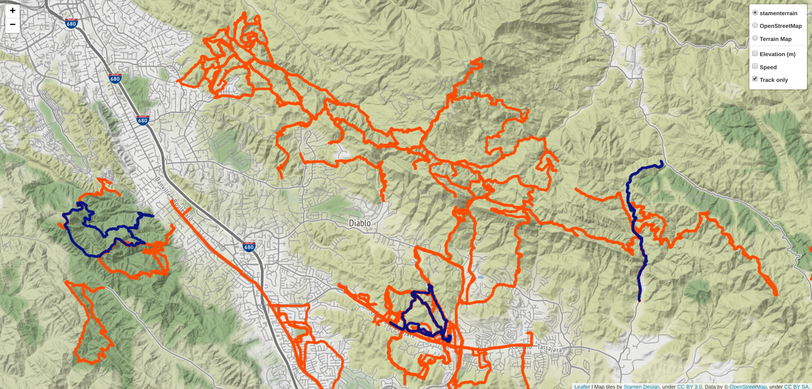

# My Route Map

Create a interactive map of all of your gps tracks 

Inline-style: 

## Table of Contents
1. [Installation](README.md#installation)
1. [Run Instructions](README.md#Run-instructions)
1. [Questions?](README.md#questions?)

## Installation

Clone the repo and enter the dictory.  

Create the python environment and change to it

`conda env create -f environment.yml`

`conda activate env_gis`

## Run Instructions

Move the example.gpx file into the directory that contains files to process.

`mv example.gpx data_input_raw/.`

Process the `gpx` file to geojson

`python process_gpx_files_to_geojson.py --data_input_raw=data_input_raw --data_processed_gpx=data_processed_gpx --data_geojson=data_geojson`

Plot the resulting data in a web browser 

`python plot_gps_points_from_geojson.py --data_geojson=data_geojson`

## Questions?
Email me at craig.matthew.smith@gmail.com
